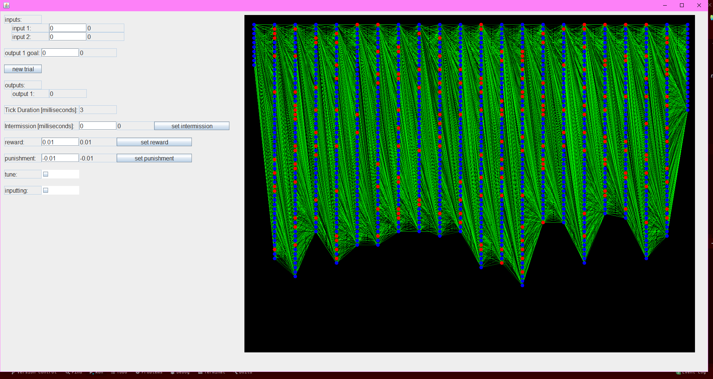

neural net project. I dont want to just copy what everyone else does. I want to figure out on my own how to do it using biology as my inspiration.

Im using Java 17 for this.

progress: the neural net itself is done. When you run Main, it opens a window (im using JFrame cuz its easy and my goal isnt to make the UI look pretty). In the window, theres a cool little visual of the neural net. normal neurons are dark blue. inhibitory neurons are red. The more voltage a neuron has, the whiter it gets. synapses are green. the more recent a synapse fired, the whiter it is. And the weaker a synapse, the darker it is (dark green at rest, dark white after firing). Theres options to change stuff during a session, like reward, punishment, putting in input, the 2 inputs, the output goal, an option for intermission in order to make it slower if you wanna see it happen more slowly. 

What im currently working on is im trying a bunch of "learning" methods that i thought of. None of them work for realzees. And I didnt expect them to. I just wanted to try them.

